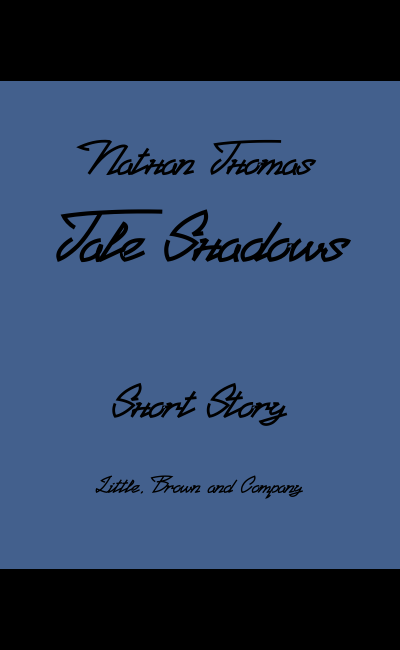

# Booksgen
Book metadata generator with support for JSON, CSV, and XML output formats, book cover generation, and both CLI and HTTP API interfaces.

## Output examples
```json
{
  "books": [
    {
      "isbn": "5858958900109",
      "title": "Breeze Forest",
      "author": "Joshua Brown",
      "genre": "Biography",
      "publisher": "Tor Books",
      "year": 1923,
      "pages": 615
    },
    {
      "isbn": "0210219808245",
      "title": "Flame Village",
      "author": "Penelope Carter",
      "genre": "Mythology",
      "publisher": "Hachette Livre",
      "year": 1987,
      "pages": 392
    }
  ]
}
```

```xml
<?xml version="1.0" encoding="UTF-8"?>
<books>
    <book>
        <isbn>5858958900109</isbn>
        <title>Breeze Forest</title>
        <author>Joshua Brown</author>
        <genre>Biography</genre>
        <publisher>Tor Books</publisher>
        <year>1923</year>
        <pages>615</pages>
    </book>
    <book>
        <isbn>0210219808245</isbn>
        <title>Flame Village</title>
        <author>Penelope Carter</author>
        <genre>Mythology</genre>
        <publisher>Hachette Livre</publisher>
        <year>1987</year>
        <pages>392</pages>
    </book>
</books>
```

```csv
isbn,title,author,genre,publisher,year,pages
8780226264412,Mind Dream,Matthew Green,Biography,Pearson,1956,555
5542422879817,Echo Thief,Jack Anderson,Thriller,Grand Central Publishing,1848,1980
9423048128989,Roots Petal,Jonathan Green,Urban Fantasy,Little, Brown and Company,1830,1699
9699057371624,Echo Rose,Lucas Perez,Children's,Random House Children's Books,1931,1201
1292087887917,Circle Rift,Avery Smith,Children's,Little, Brown and Company,1962,1601
4599389468857,Realm Storm,James Anderson,Fairy Tale,Scholastic,1857,64
2029166779416,Shield Mage,Amelia King,Steampunk,Orbit Books,1928,2044
3209489817574,Truth Legend,Ethan King,Fantasy,Knopf Doubleday,1891,1661
3819262826174,Roots Twilight,Penelope Thompson,Detective,Hachette Livre,1923,1995
9070815733095,Fate Island,Amelia Wright,Mythology,Europa Editions,1901,969
```

<p>



</p>

## Installation

### Build from source

Requires Go 1.25 or higher

```sh
git clone https://github.com/Etsor/Booksgen
cd Booksgen
./build.sh
```

### Docker

```sh
git clone https://github.com/Etsor/Booksgen
cd Booksgen
docker build -t booksgen .
```

## Usage
```sh
-st  --standalone        use standalone app
--api                    start HTTP server (default port: 8080)
-h   --help              show help
```

## Usage standalone
```sh
-j    --json             generate JSON file
-x    --xml              generate XML file
-c    --csv              generate CSV file
-a    --amount           specify amount of books (default: 1)
-o    --output           specify output directory (default: ./output/)

-cov  --cover            generate book covers
-cova --covamount        specify amount of covers (default: 1)
-covo --covoutput        specify covers output directory (default: ./covoutput/)
-covw --covwidth         specify cover width in pixels (default: 400)
-covh --covheight        specify cover height in pixels (default: 650)
```

### Examples
```sh
./build/booksgen -st -j -x -c -a 1000000 -o ./
```
Generates 3 files (.json, .xml, .csv) in `./` with 1000000 books each

```sh
./build/booksgen -st -cov -cova 100 -covo ./covers/
```
Generates 100 book covers in `./covers/`

#### Docker
```sh
docker run --rm -v ./output:/output booksgen -st -j -x -c -a 1000 -o /output
```

## Usage HTTP server
```sh
-p   --port              specify port (default: 8080)
-i   --ip                specify IP (default: all interfaces)
--log                    log incoming requests in SQLite database
                         (id, ip, endpoint, amount, timestamp)
-db  --dbpath            specify database file path (default: ./requests.db)
```

### Examples
```sh
./build/booksgen --api -p 6969
```
Starts HTTP server on all interfaces, port 6969

```sh
./build/booksgen --api -i 127.0.0.1 -p 6969
```
Starts HTTP server on 127.0.0.1:6969

```sh
./build/booksgen --api --ip 0.0.0.0 --log
```
Starts HTTP server on 0.0.0.0:8080 and logs requests to SQLite

#### Docker
```sh
docker run -p 8080:8080 booksgen --api
docker run -p 6969:6969 booksgen --api -p 6969
```

#### Example request
```sh
                                 ↓----[json|xml|csv]
curl http://127.0.0.1:8080/books/xml?amount=1000
```
Returns XML with 1000 books

## Dependencies

- [gg](https://github.com/fogleman/gg) - 2D graphics library used for cover generation
- [freetype](https://github.com/golang/freetype) - TrueType font rendering (used to load embedded fonts)
- [go-sqlite3](https://github.com/mattn/go-sqlite3) - SQLite driver for API request logging
